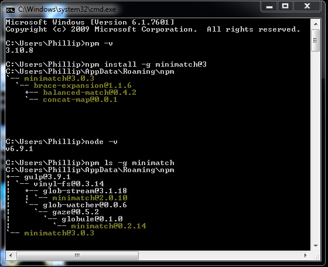
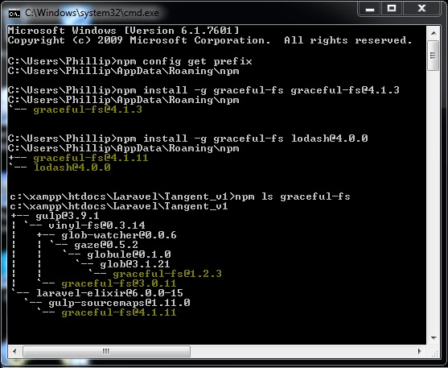
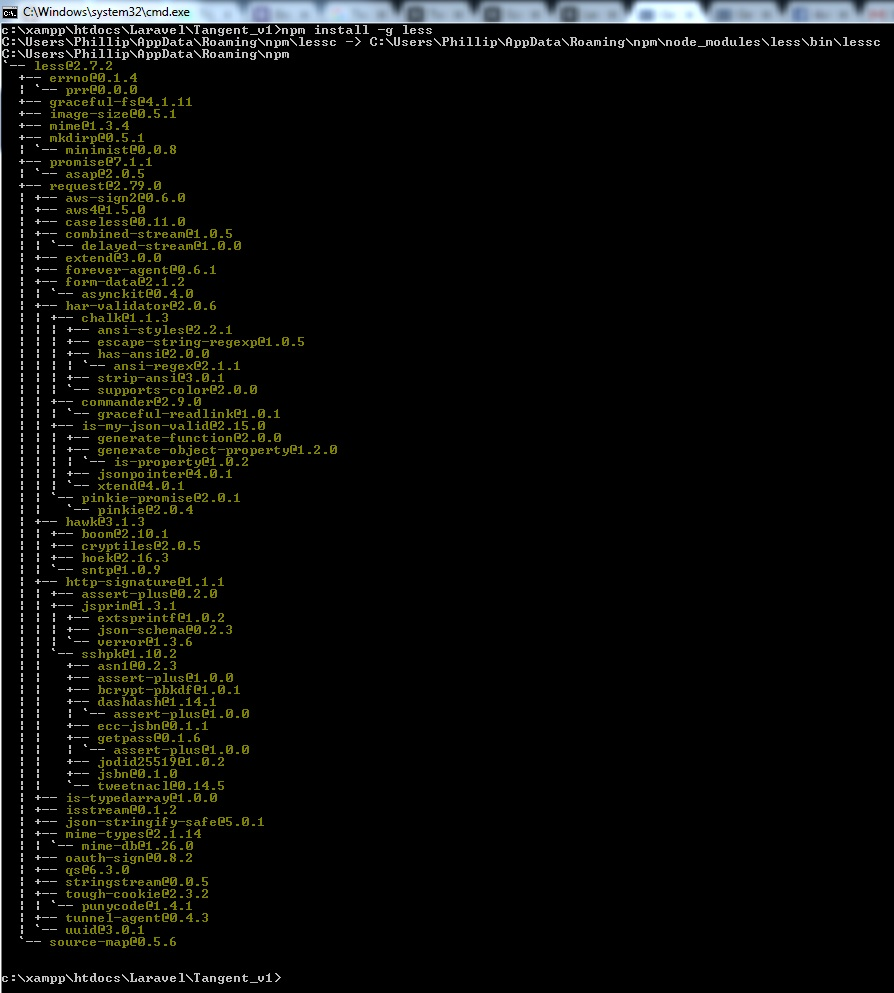

## Support

Deploy Site from Git for development

[1] Clone site from Github
<ul>
	<li> https://github.com/PhillipOdendaal/Lara_v53.git </li>
</ul>

[2] Confirm all Package managers are installed
<ul>
	<li> composer -V </li>
	<li> npm -v </li>
	<li> node -v </li>	
</ul>

[3] Update following Dependacies / Vendors - Global Updates

	[3.1] Update Minimatch
	
		npm install ls -g minimatch@3
		npm update minimatch@3.0.2 -d
		
		confirm: npm ls minimatch
		
	[3.2] Update Graceful
	
		npm install -g graceful-fs graceful-fs@4.1.3
		npm install -g graceful-fs lodash@4.0.0
		
		confirm: npm ls graceful-fs
		
		npm rebuild node-sass
	
	[3.3] Install GULP
	
		npm install --global gulp-cli
		npm install --no-bin-links (for Windows host)

[4] Install additional package from project / app folder

	[4.1] Initiate GULP
	
		npm init
		* Enter
		* Enter
	
	[4.2] Install Gulp plugins as dependancies
	
		single command:
		
		npm install gulp gulp-less gulp-sass gulp-minify-css gulp-concat gulp-uglify gulp-rename gulp-phpunit --save-dev
		
		add individual packages:
		
		* npm install --save-dev gulp-count-stat 
		* npm install --save-dev gulp-count
		* npm install --save-dev coffee-gulp
		* npm install --save-dev gulp-print

		* npm install gulp-count -g
		* npm install coffee-gulp -g
		
		If dependency was installed before, add this flag
		
		* --cache-min 999999
		
	[4.3] Confirm compilation
		
		package.json
		
	[4.4] Install Bootstrap with Bower (NPM) * Optional
	
		bower install bootstrap
			* initiated .bowerrc
			
		bower install bootstrap -S

		
	[4.5] Install Laravel Elixer
	
		npm cordova -v 
			*Check Cordova installed, needed for Elixer builder
		
		npm install --save-dev laravel-elixir-webpack
			* If error retry: " npm rebuild node-sass "
			* rerun install
			
	[4.6] Webpack Update * Nuke old webpack conflict
	
		npm i -D -E babel-preset-es2015@6.9.0

## Documentation links NPM & NODE for GULP - Elixer

<ul>
	<li> <a href="https://laravel.com/docs/5.0/elixir">Gulp for Laravel Elixer update</a>
		<ul>
			<li> node -v </li>
		</ul>
	</li>
</ul>

## Screengrabs

## Compile Bootstrap from assets for Elixer

[1] Run GULP from console in app_root else save mapping in netbeans
<ul>
	<li>" gulp watch " if you are mapping more than one</li>
</ul>

[2] Add LESS Bootstrap dependancies
Run from console in app_root
<ul>LESS_update
	<li> Add LESS Vendor with NPM
		<ul>
			<li>npm install -g less</li>
			<li>If error retry: " npm rebuild node-less " rerun previous</li>
			<li>rerun install</li>
		</ul>
	</li>
</ul>

[3] Add SASS Bootstrap dependancies
Run from console in app_root
<ul>Sass_update
	<li> Add Sass Vendor with NPM
		<ul>
			<li>npm install -g node-sass</li>
			<li>If error retry: " npm rebuild node-sass "</li>
			<li>rerun install</li>
		</ul>
	</li>
</ul>

[3] Add webpack Bootstrap dependancies
Run from console in app_root
<ul>Sass_update
	<li> Add Sass Vendor with NPM
		<ul>
			<li>npm install --save-dev laravel-elixir-webpack</li>
			<li>If error retry: " npm rebuild node-sass "</li>
			<li>rerun install</li>
		</ul>
	</li>
</ul>

[3] Add SASS Bootstrap dependancies
Run from console in app_root
<ul>Webpack_update
	<li> Nuke old webpack conflict
		<ul>
			<li>npm i -D -E babel-preset-es2015@6.9.0</li>
		</ul>
	</li>
</ul>

	
## Other updates

